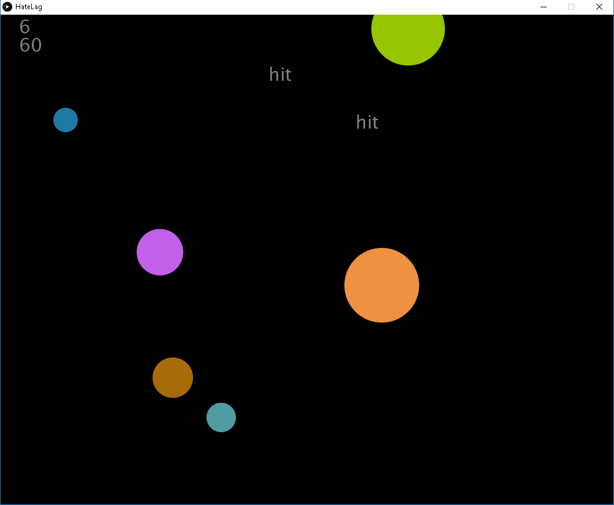

# About
Eu queria mostrar para os amigos como é ter lag, o quanto alguns milissegundos podem atrapalhar na sua reação.

O jogo é simples, clique nos circulos:  
* Acertar o clique da 1 ponto.  
* Errar o clique reseta a pontuação.  
* Use as setas CIMA e BAIXO para aumentar ou diminuir o lag.  

  
