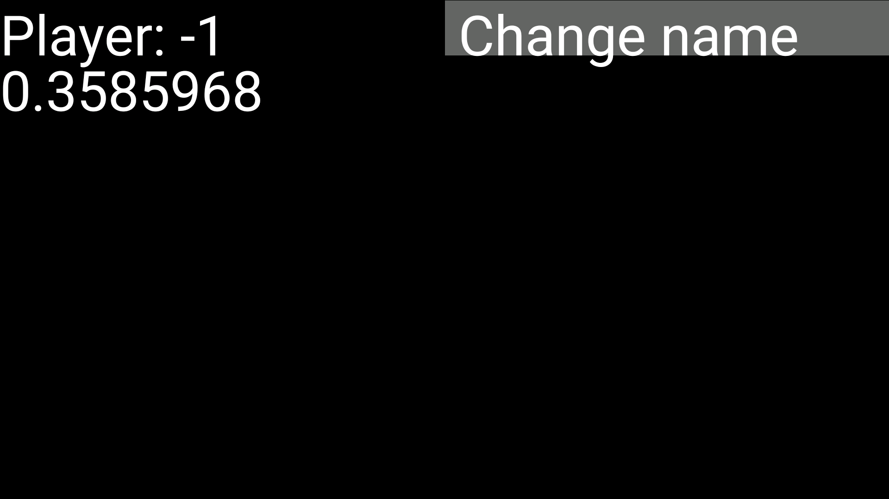
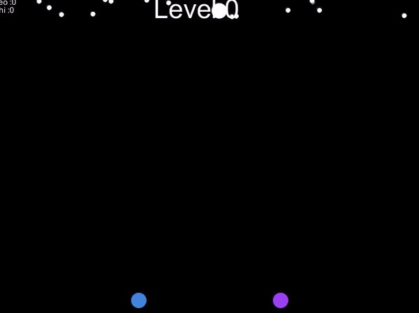
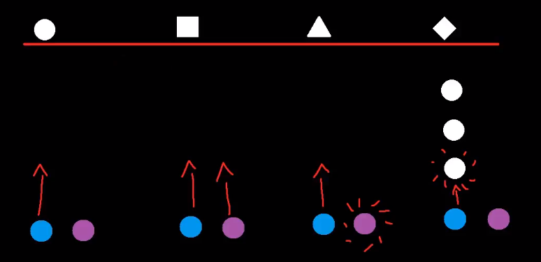

# About
Winterfells é um jogo baseado no Winterbells, jogo em flash do [Ferry Harlim](http://www.ferryhalim.com/).  
Foi criado com o objetivo de aprender a usar [Processing](https://processing.org/)  

O interessante desse jogo é que você usa o celular como controle e pode ser jogado por varias pessoas ao mesmo tempo.  
Infelizmente o multiplayer só pode ser feito por **LAN** (Local Area Network), logo todos precisam estar na mesma rede.  
O aplicativo só existe para celulares com **Android** e precisa de acelerometro.  

O objetivo do jogo é ficar vivo, basicamente a tela do jogo vai subir e você tem que pular em bolas para subir junto. Se alguma hora chegar na parte de baixo da tela, você morre.  
Como o jogo permite mais jogadores, você pode trabalhar em conjunto com os amigos para sobreviver.  

# How to play
Instale [PlayerWinterfells](https://github.com/thiagola92/PUC-DSG1412/tree/master/Exercicios/PlayerWinterfells) no seu Android e abra ele.  
Você deve receber uma tela mostrando qual jogador você é (deve aparecer -1 até o jogo começar), o valor do acelerometro e um botão para alterar seu nickname.  
Se você optar por alterar o nickname, ele vai aparecer embaixo do acelerometro.  

Agora você precisa ter Processing no computador, baixar o projeto Winterfells e botar para rodar (não vou entrar em detalhes de como fazer isso).  
A tela que vai aparecer é preta com um botão para começar o jogo, ao apertar ele vai procurar por X jogadores na sua LAN (o número de jogadores é definido no código do jogo, pode ser alterado a vontade).  
Após ele encontrar os jogadores, cada jogador vai receber uma cor para se identificarem durante o jogo.  
De agora em diante é jogar, mover o celular pra direita ou esquerda dependendo de onde você quer que vá.  

# Game
  
Nesse Gif você pode identificar as seguintes coisas:  
* Circulos brancos pequenos: Apenas efeito para parecer neve, não tem efeito nenhum na jogabilidade.  
* Circulos coloridos: São os jogadores.
* Circulos brancos: São justamente o que o jogador deve encostar para subir um pouco. Eles são destruidos quando você encosta neles.  
* Texto "Level 0": O jogo tem/teria mais leveis, dessa maneira aumentando a dificuldade.   
* Texto na esquerda em cima: Nickname dos jogadores e suas pontuações.  

Circulos brancos não são os únicas coisas nas quais você pode pular, existem no total 4 coisas em que você pode pular.   
* Circulo branco: Ao encostar nele, você da um pulo.  
* Quadrado branco: Ao encostar nele, todos jogadores dão um pulo.  
* Triângulo branco: Ao encostar nele, todos os jogadores mortos são revividos.  
* Diamante branco: Ao encostar nele, pega 5 bolas que estejam acima de você e bota elas enfrente ao seu personagem.  

